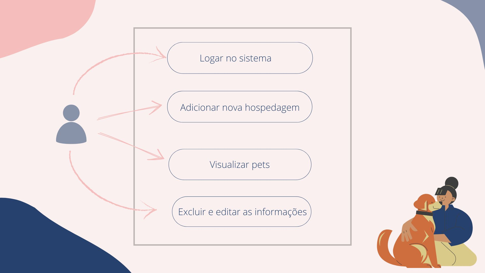
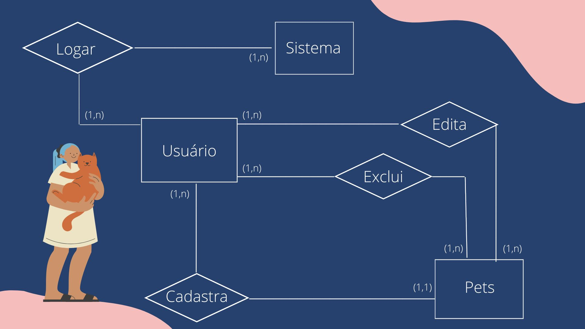

## Comentário do texto
"We see three critical differences between programming and software engineering: time, scale, and the trade-offs at play. On a software engineering project, engineers need to be more concerned with the passage of time and the eventual need for change. In a software engineering organization, we need to be more concerned about scale and efficiency, both for the software we produce as well as for the organization that is producing it. Finally, as software engineers, we are asked to make more complex decisions with higher-stakes outcomes, often based on imprecise estimates of time and growth. Within Google, we sometimes say, “Software engineering is programming integrated over time.” Programming is certainly a significant part of software engineering: after all, programming is how you generate new software in the first place. If you accept this distinction, it also becomes clear that we might need to delineate between programming tasks (development) and software engineering tasks (development, modification, maintenance). The addition of time adds an important new dimension to programming. Cubes aren’t squares, distance isn’t velocity. Software engineering isn’t programming."

Titus Winters, Software Engineering at Google

>Esse é um texto para todos aqueles que não sabem sobre o significado da engenharia de software mas principalmente para aqueles que acham que sabem sobre. É bem frisado também que os desafios dos engenheiros de software é o tempo, a usabilidade e a análise de requisitos. Ter uma direção da visão de um engenheiro de software que atua na área e entende do assunto é enriquecedor.

   

## Trade-off na API

>Trade-off ou tradeoff é uma expressão em inglês que significa o ato de escolher uma coisa em detrimento de outra e muitas vezes é traduzida como "perde-e-ganha".

O trade-off implica um conflito de escolha e uma consequente relação de compromisso, porque a escolha de uma coisa em relação à outra, implica não usufruir dos benefícios da coisa que não é escolhida. Isso implica que para que aconteça o trade-off, elemento que faz a escolha deve conhecer os lados positivos e negativos das suas oportunidades.

  

## Requisitos
**Sistema de um hotel para pets**

 

>Requisitos Funcionais:
- Cadastro de pets
   > - Nome do pet
   > - Raça
   > - Nome do Dono
   > - Número pra contato
- Vizualização de pet´s hospedados
- Consulta de vagas disponiveis
   > - Consultar na tabela quantidade de pets hospedados
- Exclusão de hospedes
- Edição de informações
 

>Requisitos não funcionais:
- Interface simples
- Controle de uso do sistema

 

## Diagrama de classes

  

## Casos de uso

  
    

## Diagrama de Classe

